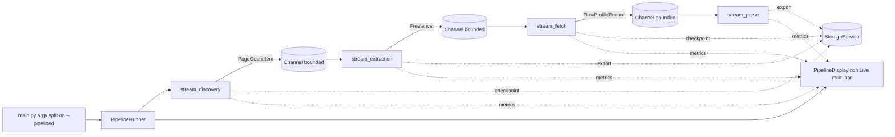

# Requirements

### Overview & Goals
Add a `--pipelined` execution mode to the CLI so several phase commands run **concurrently as a streaming pipeline** instead of strictly one-after-another. A downstream stage starts working as soon as its upstream produces the *first* usable item (a "milestone"), not when the upstream finishes.

Today `main.py scrape` calls `run_discovery()` → `run_extraction()` → `run_fetch()` → `run_parse()` sequentially, and each phase re-reads a complete file written by the previous one (`pagination_cache.json` → `mostaql_development_all_users.json` → `checkpoint_fetch.jsonl`). That means the network sits idle for a long time while discovery binary-searches ~300 combos.

### Scope
**In scope**
- Chained CLI syntax: `python main.py <cmd-a> [opts] --pipelined <cmd-b> [opts] --pipelined <cmd-c> [opts]`.
- Streaming, in-process async handoff between `discovery`, `extract`, `fetch`, `parse`.
- Per-command *position capability* (`start` / `middle` / `end`) with validation and updated `--help` text describing which positions each command supports and which options are valid in each position.
- Concurrency/backpressure control per stage, live multi-bar progress, per-stage logging.
- All existing checkpoint/export files keep being written, so `--continue` still works and a pipelined run is resumable.

**Out of scope**
- Changing scraping/parsing logic, selectors, or the combo list.
- Multi-process or distributed execution.
- Changing the behaviour of the existing non-pipelined commands (they stay byte-for-byte compatible).

### User Stories
- As a user, I run `python main.py discovery --pipelined extract --pipelined fetch --pipelined parse` and all four phases work at the same time, each consuming its upstream's output as it appears.
- As a user, I can start mid-pipeline (`python main.py fetch --limit 500 --pipelined parse`) because `fetch` can seed itself from the existing `output_json`.
- As a user, if I write an impossible chain (e.g. `parse --pipelined discovery`), the CLI refuses with a clear message naming the offending stage and its allowed positions.
- As a user, I see one live progress bar per stage with throughput and queue depth, and logs do not destroy the display.

### Functional Requirements
1. `--pipelined` acts as a **separator** in argv; each segment is parsed with that command's own options.
2. A stage in `start` position seeds itself from disk exactly like today. A stage in `middle`/`end` position consumes its upstream channel and ignores/rejects the disk-seeding-only options.
3. Every stage emits *milestone items* as soon as they are produced:
   - discovery → one `(combo, last_page)` per solved combo,
   - extract → batches of unique `Freelancer` records,
   - fetch → one raw HTML record per profile,
   - parse → one `ProfileDetails` per record.
4. Each stage signals completion with an end-of-stream sentinel; downstream drains then finalises (export + `print_phase_stats`).
5. Bounded queues provide backpressure so a fast upstream cannot exhaust memory.
6. A failure in one stage cancels the pipeline cleanly, flushes checkpoints, and reports which stage failed.
7. Session summary (`MetricsRegistry.print_aggregate`) still prints once, covering all stages that ran.

### Non-Functional Requirements
- Global politeness preserved: the shared rate limit / semaphores must not be multiplied by running stages in parallel.
- No change to output file formats.
- Windows-console friendly output (project already targets PowerShell).

# Technical Design

### Current Implementation
- `main.py` — Typer app, one function per phase (`discovery`, `extract`, `fetch`, `parse`, `deep_scrape`, `scrape`), each doing `asyncio.run(orch.run_*())` then `orch.print_session_summary()`.
- `src/services/orchestrator.py` — `ScraperOrchestrator` with `run_discovery`, `run_extraction`, `run_fetch`, `run_parse`. Each: creates a `PhaseMetrics`, builds an `asyncio.Queue` of jobs, spawns N workers, `await queue.join()`, writes files, registers metrics, prints stats.
- `src/utils/reporting.py` — `PhaseMetrics` (thread-safe counters), `MetricsRegistry`, `print_scraper_header`, `print_phase_stats`, `print_completion_paths`. Progress via a single `tqdm` bar per phase.
- `src/services/storage.py` — plain JSON/JSONL/CSV IO, **not** concurrency-safe for simultaneous writers.
- `src/utils/combos.py` `ComboManager`, `src/services/parser.py` `ParsingService`, `src/services/network.py` `NetworkService`.

### Key Decisions
1. **In-process async queues** (chosen by user) — stages are coroutines connected by bounded `asyncio.Queue` channels, all inside a single `asyncio.run` / `TaskGroup`. Files are still written as checkpoints but are no longer the handoff mechanism.
2. **Refactor each phase into `seed → produce → consume` form** rather than duplicating code: the existing `run_*` methods become thin wrappers that call the new streaming implementation with a disk-seeded input channel and a null output channel. This guarantees non-pipelined behaviour is unchanged.
3. **Position capability declared per stage** in a registry (`StagePosition.START | MIDDLE | END`), used both for chain validation and for generating help text.
4. **Single shared `StorageService` write lock** — an `asyncio.Lock` per file path so concurrent stages appending to different checkpoints never interleave lines.
5. **Rich `Live` multi-bar display** replaces per-phase `tqdm` in pipelined mode; logging is redirected to a file + a small rolling log panel so bars stay intact.

### Proposed Changes

#### 1. New package `src/pipeline/`
- `channel.py` — `Channel`: thin wrapper over bounded `asyncio.Queue` with `send(item)`, `close()`, `__aiter__`, plus `depth`, `sent`, `received` counters for the progress display. Includes `NullChannel` (drops items) and `SeededChannel` (yields items loaded from disk, used for `start` position).
- `spec.py` — `StageSpec` dataclass: `name`, `positions: set[StagePosition]`, `options: dict`, `input_type`, `output_type`, `concurrency`. A `STAGE_REGISTRY` maps `discovery/extract/fetch/parse` to their specs and to the orchestrator coroutine that implements them.
- `runner.py` — `PipelineRunner`:
  - validates the chain (positions, adjacent type compatibility, duplicates),
  - creates one `Channel` per link,
  - launches every stage concurrently, wires the live display,
  - handles cancellation/exception propagation and final `print_session_summary()`.
- `cli_chain.py` — argv pre-processing: splits `sys.argv` on `--pipelined`, resolves each segment's command name, delegates option parsing of each segment to the existing Typer/Click command parsers so option definitions are not duplicated.

#### 2. `src/services/orchestrator.py`
Add streaming variants alongside the current methods:

```python
async def stream_discovery(self, out: Channel, *, use_continue: bool = True) -> None
async def stream_extraction(self, inp: Channel | None, out: Channel, *, use_continue: bool = True) -> None
async def stream_fetch(self, inp: Channel | None, out: Channel, *, limit=None, use_continue=True) -> None
async def stream_parse(self, inp: Channel | None, out: Channel, *, use_continue: bool = True) -> None
```

- `stream_discovery`: same binary search + worker pool as `_discovery_worker`, but each solved combo is `await out.send(PageCountItem(label, combo, last_page))` immediately, and the pagination cache is flushed periodically instead of only at the end.
- `stream_extraction`: when `inp` is `None` it builds jobs from `pagination_cache.json` (today's behaviour); otherwise it consumes `PageCountItem`s from `inp` as they arrive and pushes each new combo onto its internal job queue. New unique `Freelancer`s are forwarded downstream in small batches; dedup set stays in memory as today.
- `stream_fetch`: consumes `Freelancer` items (or seeds from `output_json`), keeps its `profile_concurrency` worker pool, writes `checkpoint_fetch.jsonl` as today and forwards each raw record downstream.
- `stream_parse`: becomes `async`, consumes raw records (or seeds from `checkpoint_fetch.jsonl`), parses in a thread executor to avoid blocking the loop, accumulates results and exports on close.
- Existing `run_discovery/run_extraction/run_fetch/run_parse` are rewritten to call their `stream_*` counterpart with `inp=None, out=NullChannel()` and keep printing the exact same stats — no behavioural change for current commands.
- `run_parse` keeps a sync wrapper for the existing `parse` command.

#### 3. `main.py`
- Before `app()`, call `cli_chain.detect(sys.argv)`. If no `--pipelined` present → current behaviour untouched.
- If present → build `StageSpec`s and run `PipelineRunner`.
- Update the docstring/help of `discovery`, `extract`, `fetch`, `parse` with a **Pipelined positions** section listing allowed positions and which options apply where; add `--pipelined` to the app help and to `examples`.

#### 4. `src/utils/reporting.py`
- Add `PipelineDisplay`: a `rich.live.Live` wrapping a `Progress` with one task per stage (`completed/total` where total may be unknown → spinner + count), plus columns for throughput (`PhaseMetrics.get_throughput`) and inbound queue depth.
- Add a `logging.Handler` that feeds a bounded rolling log panel and mirrors everything to `pipeline.log`.
- `MetricsRegistry` gains ordering by stage index so the aggregate table reads in pipeline order.

### Data Models / Contracts

 Stage | Position support | Consumes | Produces |
---|---|---|---|
 `discovery` | start | – (combos from `ComboManager`) | `PageCountItem` |
 `extract` | start, middle | `PageCountItem` | `Freelancer` |
 `fetch` | start, middle | `Freelancer` | `RawProfileRecord` |
 `parse` | start, middle, end | `RawProfileRecord` | `ProfileDetails` |

Any stage may also be the last one in the chain (its output goes to a `NullChannel` and it just exports as usual).

```python
@dataclass(frozen=True)
class PageCountItem:
    label: str
    combo: Dict[str, Any]
    last_page: int

@dataclass(frozen=True)
class RawProfileRecord:
    profile_url: str
    html: Optional[str]
    portfolio_html: Optional[str]
```

### File Structure
```
main.py                      (modified: --pipelined dispatch + help text)
src/pipeline/__init__.py     (new)
src/pipeline/channel.py      (new)
src/pipeline/spec.py         (new)
src/pipeline/runner.py       (new)
src/pipeline/cli_chain.py    (new)
src/services/orchestrator.py (modified: stream_* methods, run_* become wrappers)
src/services/storage.py      (modified: per-path async write lock)
src/utils/reporting.py       (modified: PipelineDisplay + log handler)
test/                        (new tests for chain parsing, validation, channels)
```

### Architecture Diagram


### Risks
- **Rate limiting**: four stages hitting the network at once can trip 429s. Mitigation — a single process-wide limiter instance shared by all `NetworkService` objects, and per-stage semaphores sized from `ScrapeConfig` (`dir_concurrency`, `profile_concurrency`) rather than duplicated.
- **Unknown totals**: in pipelined mode a downstream stage does not know its final total up front. Mitigation — progress bars show a growing total that is revised as the upstream reports more work, and switch to determinate once the upstream closes.
- **Blocking parse**: `parse_profile` is CPU-bound and would stall the event loop. Mitigation — run it via `asyncio.to_thread`.
- **Concurrent file writes**: `StorageService` currently has no locking. Mitigation — per-path `asyncio.Lock`.
- **Refactor regression**: rewriting `run_*` as wrappers risks changing existing output. Mitigation — keep stats printing in the wrappers and cover the non-pipelined path with tests.

# Testing

### Validation Approach
Mostly offline: exercise the chain parser, position validation, and channel plumbing with fake stages, then a single small live smoke run.

### Key Scenarios
- `python main.py discovery --pipelined extract --pipelined fetch --pipelined parse` — all four stages start, extract begins before discovery finishes (assert extract's first item timestamp < discovery completion timestamp using fake stages).
- `python main.py fetch --limit 5 --pipelined parse` — fetch seeds from `output_json`, parse consumes the stream, both export.
- `python main.py extract` (no `--pipelined`) — output files and printed stats identical to before the refactor.
- Live smoke: `python main.py discovery --pipelined extract` against a trimmed combo list, confirming real URLs land in `mostaql_development_all_users.json`.

### Edge Cases
- `parse --pipelined discovery` → rejected with a message listing `discovery` as start-only.
- Duplicate stage in the chain → rejected.
- Upstream produces zero items → downstream closes cleanly and reports 0 without hanging.
- Upstream raises → whole pipeline cancels, checkpoints flushed, failing stage named in the summary.
- Bounded channel full → upstream blocks (backpressure) rather than growing unbounded; assert queue depth never exceeds the configured maximum.
- `Ctrl+C` mid-run → graceful cancellation, partial checkpoints remain resumable with `--continue`.

### Test Changes
Add under `test/`:
- `test_cli_chain.py` — argv splitting and per-segment option parsing.
- `test_pipeline_validation.py` — position/type compatibility rules.
- `test_channel.py` — send/close/iterate, backpressure, sentinel handling.
- `test_pipeline_runner.py` — fake stages asserting overlap, cancellation, and metrics registration order.

# Delivery Steps

### ✓ Step 1: Add the streaming channel and stage-spec foundation
A new `src/pipeline` package provides the channel abstraction and the stage registry that later work builds on.

- Create `src/pipeline/channel.py` with `Channel` (bounded `asyncio.Queue` wrapper exposing `send`, `close`, `__aiter__`, `depth`, `sent`, `received`), plus `NullChannel` and `SeededChannel`.
- Create `src/pipeline/spec.py` with `StagePosition` enum, the `StageSpec` dataclass (name, allowed positions, input/output item types, concurrency, options), and `STAGE_REGISTRY` entries for `discovery`, `extract`, `fetch`, `parse` per the capability table in the Technical Design.
- Define the transported item types `PageCountItem` and `RawProfileRecord` (in `src/models.py` next to `Freelancer`/`ProfileDetails`).
- Add `test/test_channel.py` covering send/close/iterate, sentinel handling, and backpressure when the queue is full.

### ✓ Step 2: Refactor orchestrator phases into streaming producers/consumers
Every phase can run as a coroutine that consumes an input channel and emits milestone items, while the existing commands behave exactly as before.

- Add `stream_discovery`, `stream_extraction`, `stream_fetch`, `stream_parse` to `src/services/orchestrator.py` with the signatures from the Technical Design.
- `stream_discovery`: emit a `PageCountItem` immediately after each combo's binary search and flush `pagination_cache.json` periodically.
- `stream_extraction`: accept combos either from `pagination_cache.json` (start) or from the input channel (middle); forward newly discovered unique `Freelancer` records in batches.
- `stream_fetch`: accept `Freelancer` items or seed from `output_json`; keep appending to `checkpoint_fetch.jsonl` and forward each `RawProfileRecord`.
- `stream_parse`: run `parse_profile` via `asyncio.to_thread`, accumulate results, export on stream close.
- Rewrite `run_discovery/run_extraction/run_fetch/run_parse` as thin wrappers over the `stream_*` methods using `inp=None, out=NullChannel()`, preserving current stats and file output.
- Add a per-path `asyncio.Lock` to `StorageService` so concurrent stages can append safely.

### ✓ Step 3: Implement the chained --pipelined CLI parsing and validation
`python main.py a --pipelined b --pipelined c` is parsed into an ordered list of validated stage specs, and help text documents each command's allowed positions.

- Create `src/pipeline/cli_chain.py` that splits `sys.argv` on `--pipelined` and parses each segment with the corresponding Typer/Click command so option definitions are not duplicated.
- Hook the detection into `main.py` before `app()`; when no `--pipelined` is present, fall through to the current Typer behaviour untouched.
- Implement validation: first stage must support `start`, last must support `end`, intermediates must support `middle`, adjacent output/input types must match, no duplicate stages — with clear error messages naming the stage and its allowed positions.
- Update the docstrings/`--help` of `discovery`, `extract`, `fetch`, `parse` with a Pipelined positions section and note which options only apply in `start` position; extend the `examples` command with pipelined invocations.
- Add `test/test_cli_chain.py` and `test/test_pipeline_validation.py`.

### ✓ Step 4: Build the PipelineRunner with concurrency and failure handling
All stages of a validated chain execute concurrently with backpressure, clean cancellation, and a combined session summary.

- Create `src/pipeline/runner.py` with `PipelineRunner` that instantiates one bounded `Channel` per link and launches every stage coroutine concurrently under a single event loop.
- Share a single rate limiter across all `NetworkService` instances and size per-stage semaphores from `ScrapeConfig` (`dir_concurrency`, `profile_concurrency`) so politeness is unchanged.
- Implement error propagation: a stage exception cancels the rest, closes channels, flushes checkpoints, and reports the failing stage.
- Handle `KeyboardInterrupt` for graceful shutdown leaving resumable checkpoints.
- Register each stage's `PhaseMetrics` in the shared `MetricsRegistry` in pipeline order and print one aggregate summary at the end.
- Add `test/test_pipeline_runner.py` with fake stages asserting stage overlap, backpressure, cancellation, and metrics ordering.

### ✓ Step 5: Add the live multi-bar progress and per-stage logging display
A pipelined run shows one live progress bar per stage with throughput and queue depth, and logs no longer corrupt the display.

- Add `PipelineDisplay` to `src/utils/reporting.py` using `rich.live.Live` + `Progress`, with one task per stage and columns for completed count, throughput (via `PhaseMetrics.get_throughput`) and inbound queue depth.
- Support indeterminate totals that are revised upward as upstream reports more work, switching to determinate once the upstream channel closes.
- Add a logging handler that renders a bounded rolling log panel and mirrors all records to `pipeline.log`.
- Wire the display into `PipelineRunner`, suppressing the per-phase `tqdm` bars only in pipelined mode.
- Order `MetricsRegistry.print_aggregate` output by stage index so the final table reads in pipeline order.