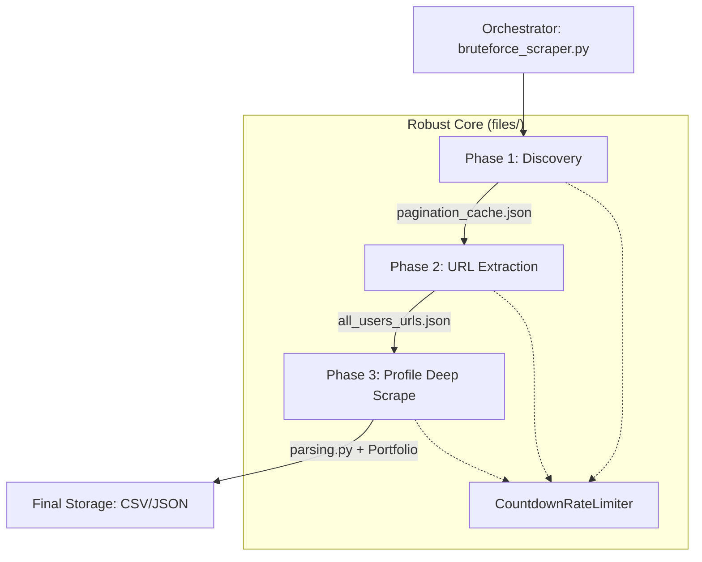
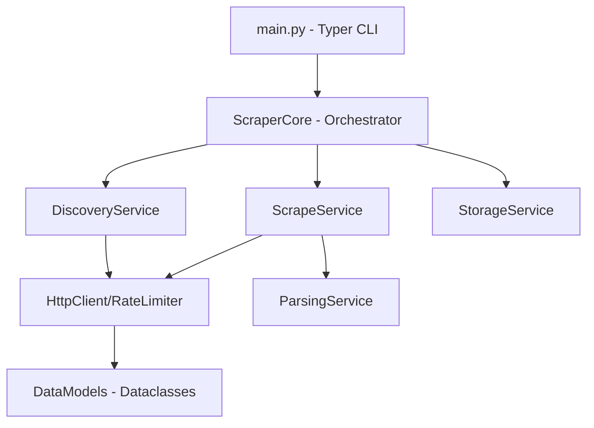

# Requirements

### Overview & Goals
The goal is to merge the two independent scrapers into a professional, unified pipeline residing within the `files/` directory. By moving the detailed profile scraping logic into the "bruteforce" system, we leverage its superior rate limiting, reporting, and caching capabilities.

### Scope
- **In Scope**:
    - Migrating `parsing.py` to the `files/` directory.
    - Implementing a new Phase 3 for detailed profile extraction using the discovered URLs.
    - Integrating the advanced `CountdownRateLimiter` and progress reporting into the profile scraping phase.
    - Creating a unified command-line interface to run the full pipeline (Discovery -> Scrape URLs -> Scrape Profiles).
- **Out of Scope**:
    - Changing the core "bruteforce" strategy (it remains the source of truth for discovery).
    - Modifying the outer root files (they will be superseded by the `files/` directory version).

# Technical Design

### Current Implementation
- **Discovery**: `files/pagination_discovery.py` performs a binary search on 300+ filter combinations to find all possible profile URLs.
- **URL Scraper**: `files/bruteforce_scraper.py` currently extracts only names and profile URLs into `mostaql_development_all_users.json`.
- **Profile Scraper (Old)**: `scraper.py` and `fetch.py` in the root have the logic for deep profile parsing (stats, portfolio, etc.) but lack the robust rate limiting of the `files/` versions.

### Proposed Changes
1.  **Module Migration**: Move and adapt `parsing.py` to `files/`.
2.  **Phase 3 Implementation**: Create a new execution phase that takes the unique URLs from Phase 2 and performs "Deep Scrapes".
3.  **Unified Pipeline**: Update `bruteforce_scraper.py` to act as the main orchestrator.

### Architecture Diagram

### Key Decisions
- **Worker-based Architecture**: Use the existing worker pattern from `bruteforce_scraper.py` for Phase 3 to ensure high performance and stability.
- **Shared Limiter**: Use the same `CountdownRateLimiter` class across all phases for consistent behavior when hitting Mostaql's protections.
- **Independent Phases**: Allow running specific phases (e.g., just Phase 3 if URLs are already extracted) via CLI flags.

# Professional Mostaql Scraper Pipeline Plan

## Requirements

### Overview & Goals
Refactor the existing Mostaql scraper into a professional, modular, and high-quality Python project. The goal is to apply SOLID principles, improve code reuse, and leverage modern Python features like dataclasses, type hinting, and professional logging.

### Scope
- **In Scope**:
    - **Modularization**: Split large files into logical components (e.g., `models.py`, `networking.py`, `storage.py`, `parsing.py`).
    - **Single Responsibility Principle (SRP)**: Ensure each class/module has one clear purpose.
    - **Object-Oriented Design**: Replace global states and procedural loops with service-oriented classes.
    - **Modern Python Features**: Use `dataclasses` for data structures, `pathlib` for file operations, and comprehensive type hints.
    - **Unified Configuration**: Centralize and formalize configuration management.
    - **Documentation**: Add Google-style or NumPy-style docstrings to all major components.
- **Out of Scope**:
    - Changing the core scraping logic or brute-force strategy.
    - Adding new scraping targets or categories beyond "development".

### Functional Requirements
- The CLI (`main.py`) must retain all existing functionality and flags.
- Checkpointing and rate limiting must remain robust and integrated.
- The system must handle large datasets efficiently with minimal memory overhead.

## Technical Design

### Current Implementation
- **Procedural Orchestration**: `bruteforce_scraper.py` and `profile_scraper.py` contain large async loops with shared global state.
- **Mixed Concerns**: Network calls, HTML parsing, and file I/O are often interleaved in the same functions.
- **Redundancy**: Similar worker/queue patterns are implemented separately for discovery and deep scraping.

### Proposed Architecture
We will move from a flat, script-based structure to a layered service architecture.

### Key Components

1.  **`models.py`**:
    - `Freelancer`: Dataclass for basic info (Phase 2).
    - `ProfileDetails`: Dataclass for deep info (Phase 3).
    - `ScrapeConfig`: Dataclass for runtime parameters.
2.  **`services/` (New Directory)**:
    - `network.py`: Handles `aiohttp` sessions, retries, and the `CountdownRateLimiter`.
    - `parser.py`: Encapsulates all BeautifulSoup/lxml logic.
    - `storage.py`: Dedicated service for JSONL/CSV writing and checkpointing.
    - `orchestrator.py`: The high-level logic that coordinates discovery and scraping phases.
3.  **`utils/` (New Directory)**:
    - `logging.py`: Professional logging setup.
    - `helpers.py`: Shared utility functions.

### Key Decisions
- **Dataclasses for State**: Replace dictionary-based state with frozen dataclasses to improve type safety and readability.
- **Dependency Injection**: Pass services (Storage, Network) to the orchestrator to allow for easier testing and configuration.
- **Unified Progress Management**: Create a shared `ProgressManager` to handle `tqdm` and `rich` output consistently.

## Delivery Plan

### ✓ Step 1: Define Models and Formalize Config
Create a foundation for type-safe data handling.
- Create `src/models.py` with `Freelancer` and `ProfileDetails` dataclasses.
- Update `config.py` to use a typed configuration class.
- Move `combos.py` logic into a structured `ComboManager`.

### ✓ Step 2: Extract Services (Networking & Storage)
Decouple the core engine from external dependencies.
- Implement `NetworkService` with integrated rate limiting and retry logic.
- Implement `StorageService` to handle unified checkpointing and file flushing for both phases.
- Refactor `parsing.py` into a stateless `ParsingService`.

### ✓ Step 3: Implement Scraper Orchestrator
Consolidate the scraping loops into a reusable engine.
- Create a `BaseScraper` class that implements the worker/queue pattern.
- Implement `DiscoveryScraper` and `ProfileScraper` as specialized subclasses.
- Connect everything in a high-level `ScraperOrchestrator`.

### ✓ Step 4: Final CLI Update and Documentation
Clean up the entry point and add polish.
- Update `main.py` to use the new `ScraperOrchestrator`.
- Add docstrings and type hints throughout the codebase.
- Perform final cleanup of any remaining stale or redundant code.

# Delivery Steps

### ✓ Step 1: Migrate and Update Parsing Logic
Enhance the system in the `files/` folder to support detailed profile parsing.
- Migrate `parsing.py` from the root directory into the `files/` directory.
- Update `files/parsing.py` to ensure it works correctly with the `files/config.py` and other local modules.
- Verify that the profile extraction logic is robust and matches the quality of the discovery logic.

### ✓ Step 2: Implement Detailed Profile Scraper
Develop a new script `files/profile_scraper.py` (or extend `bruteforce_scraper.py`) to handle the detailed profile scraping phase.
- Implement a worker-based pipeline that reads discovered profile URLs.
- Integrate `CountdownRateLimiter` from `files/common.py` for consistent, advanced rate limiting.
- Add support for fetching both the main profile and the portfolio tab, as seen in the original `fetch.py`.

### ✓ Step 3: Integrate Phases and Unified Reporting
Connect the discovery and extraction phases into a seamless, multi-phase system.
- Update `files/bruteforce_scraper.py` to optionally trigger the detailed profile scrape after discovery.
- Implement unified checkpointing so that if a profile scrape is interrupted, it can resume from the last saved profile.
- Ensure the final output (CSV/JSON) contains the full merged profile data, replacing the placeholder name/URL records.