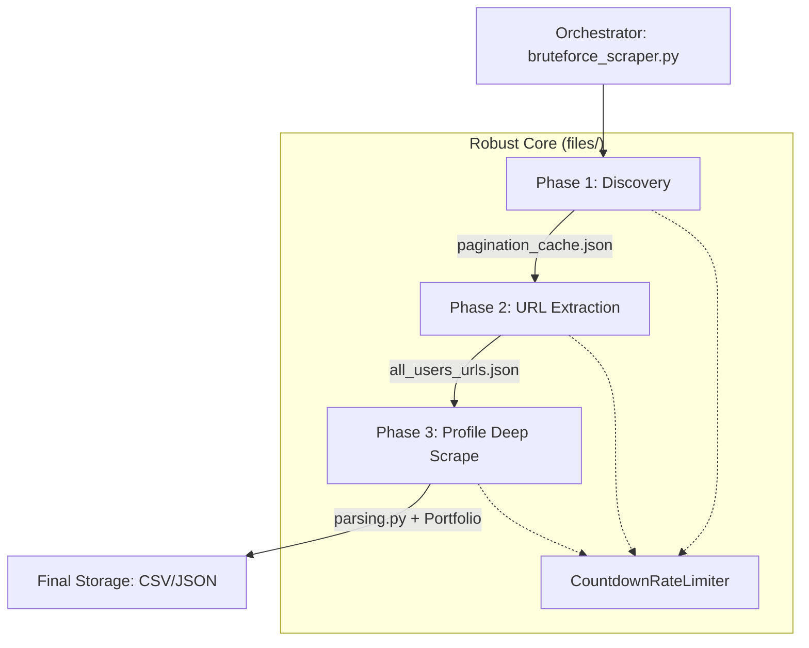

# Requirements

### Overview & Goals
The goal is to merge the two independent scrapers into a professional, unified pipeline residing within the `files/` directory. By moving the detailed profile scraping logic into the "bruteforce" system, we leverage its superior rate limiting, reporting, and caching capabilities.

### Scope
- **In Scope**:
    - Migrating `parsing.py` to the `files/` directory.
    - Implementing a new Phase 3 for detailed profile extraction using the discovered URLs.
    - Integrating the advanced `CountdownRateLimiter` and progress reporting into the profile scraping phase.
    - Creating a unified command-line interface to run the full pipeline (Discovery -> Scrape URLs -> Scrape Profiles).
- **Out of Scope**:
    - Changing the core "bruteforce" strategy (it remains the source of truth for discovery).
    - Modifying the outer root files (they will be superseded by the `files/` directory version).

# Technical Design

### Current Implementation
- **Discovery**: `files/pagination_discovery.py` performs a binary search on 300+ filter combinations to find all possible profile URLs.
- **URL Scraper**: `files/bruteforce_scraper.py` currently extracts only names and profile URLs into `mostaql_development_all_users.json`.
- **Profile Scraper (Old)**: `scraper.py` and `fetch.py` in the root have the logic for deep profile parsing (stats, portfolio, etc.) but lack the robust rate limiting of the `files/` versions.

### Proposed Changes
1.  **Module Migration**: Move and adapt `parsing.py` to `files/`.
2.  **Phase 3 Implementation**: Create a new execution phase that takes the unique URLs from Phase 2 and performs "Deep Scrapes".
3.  **Unified Pipeline**: Update `bruteforce_scraper.py` to act as the main orchestrator.

### Architecture Diagram

### Key Decisions
- **Worker-based Architecture**: Use the existing worker pattern from `bruteforce_scraper.py` for Phase 3 to ensure high performance and stability.
- **Shared Limiter**: Use the same `CountdownRateLimiter` class across all phases for consistent behavior when hitting Mostaql's protections.
- **Independent Phases**: Allow running specific phases (e.g., just Phase 3 if URLs are already extracted) via CLI flags.

# Delivery Steps

### ✓ Step 1: Migrate and Update Parsing Logic
Enhance the system in the `files/` folder to support detailed profile parsing.
- Migrate `parsing.py` from the root directory into the `files/` directory.
- Update `files/parsing.py` to ensure it works correctly with the `files/config.py` and other local modules.
- Verify that the profile extraction logic is robust and matches the quality of the discovery logic.

### ✓ Step 2: Implement Detailed Profile Scraper
Develop a new script `files/profile_scraper.py` (or extend `bruteforce_scraper.py`) to handle the detailed profile scraping phase.
- Implement a worker-based pipeline that reads discovered profile URLs.
- Integrate `CountdownRateLimiter` from `files/common.py` for consistent, advanced rate limiting.
- Add support for fetching both the main profile and the portfolio tab, as seen in the original `fetch.py`.

### ✓ Step 3: Integrate Phases and Unified Reporting
Connect the discovery and extraction phases into a seamless, multi-phase system.
- Update `files/bruteforce_scraper.py` to optionally trigger the detailed profile scrape after discovery.
- Implement unified checkpointing so that if a profile scrape is interrupted, it can resume from the last saved profile.
- Ensure the final output (CSV/JSON) contains the full merged profile data, replacing the placeholder name/URL records.
