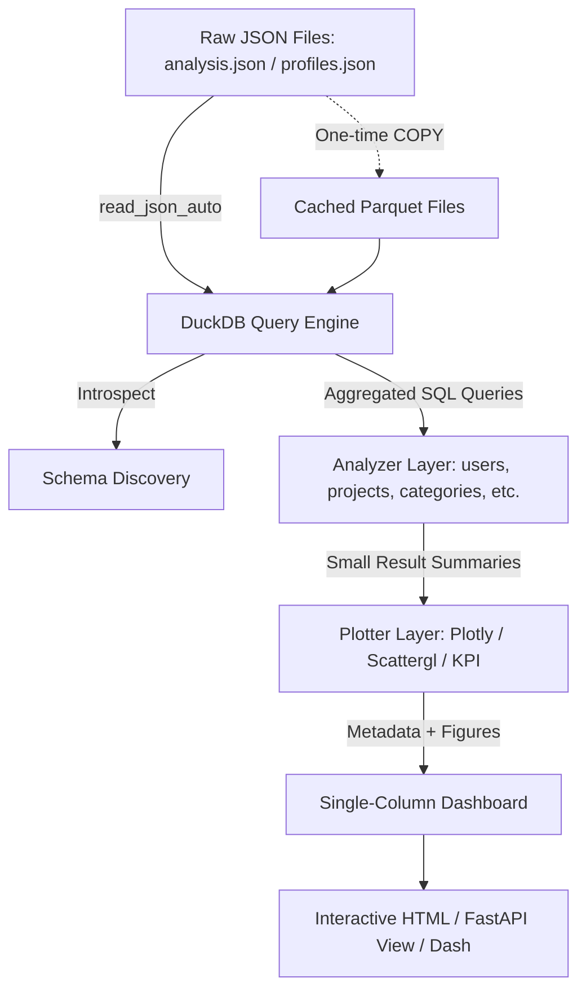

# Requirements

### Overview & Goals
The goal is to build a high-performance, modular `dashboard/*` analytics sub-module capable of analyzing and visualizing large JSON datasets (such as `collected/analysis.json` and `collected/profiles.json`) containing up to millions of records. Standard in-memory Python libraries (e.g. `pandas.read_json` or `json.load`) fail or crash on multi-gigabyte JSON files due to RAM limits. This solution establishes DuckDB as the core analytical engine to perform filtering, binning, sampling, unnesting, and aggregation directly on disk or via compressed Parquet caches, passing only small aggregated results to visualization components.

### Scope
- **In Scope:**
  - DuckDB integration querying `.json` directly via `read_json_auto` with optional Parquet conversion caching.
  - Layered architecture: `dashboard/db/` (data access & schema discovery), `dashboard/analyzer/` (pure SQL aggregations), `dashboard/plotter/` (Plotly chart rendering), and `dashboard/dashboard.py` (orchestration).
  - Complete catalog of 29 analytical charts across 9 thematic sections, each formatted with `[Title, Description, Chart]`.
  - Strict single-column vertical layout where every chart occupies the full container width.
  - Dynamic dataset schema discovery that automatically enables or skips charts based on detected columns.
  - WebGL acceleration (`Scattergl`) and SQL sampling/binning to guarantee sub-second rendering and minimal memory footprint.
  - Integration with existing FastAPI / standalone HTML reporting workflows.

- **Out of Scope:**
  - Loading raw multi-million-row JSON files entirely into Python / Pandas memory.
  - Two-column or side-by-side grid layouts.
  - External database server dependencies (PostgreSQL, ClickHouse, etc.) — DuckDB is embedded and self-contained.

### User Stories
- **As a Data Analyst / Developer**, I want to open datasets with millions of records without running out of RAM so that I can immediately explore insights and trends.
- **As a Stakeholder**, I want each chart clearly explained with a Title and Description in a clean single-column dashboard so that findings are easy to interpret.
- **As a System Maintainer**, I want the analytics and plotting layers strictly decoupled so that new queries, metrics, or export formats can be added effortlessly.

### Functional Requirements
1. **Zero Full-Dataset Materialization:** No analytical calculation may materialize the full raw dataset in Python memory.
2. **Schema Introspection & Graceful Fallbacks:** The system must inspect dataset fields on startup and dynamically toggle visualizations based on field availability (e.g., skills, categories, timestamps, locations).
3. **Parquet Acceleration:** Support one-time conversion from JSON to columnar Parquet for 10x-50x faster repeated analytical queries.
4. **Structured Chart Metadata:** Every chart must expose standard metadata:
   ```text
   [
     Title: <Clean human-readable title>,
     Description: <Analytical explanation and context>,
     <Interactive Chart Component>
   ]
   ```
5. **Single-Column Vertical Layout:** Sections must flow sequentially: Overview -> User Activity -> Concentration -> Categories -> Skills -> Temporal -> Geography -> Data Quality -> Advanced Insights.
6. **Bounded Result Sizes:** Visualizations must strictly enforce max row limits (e.g., Top 20 categories, 50-100 histogram bins, max 50k sampled points with `Scattergl`).

### Non-Functional Requirements
- **Memory Footprint:** Peak RAM consumption under 256MB during query execution even on multi-million row files.
- **Performance:** Sub-second response times for aggregated charts when querying Parquet caches.
- **Extensibility:** Simple plug-and-play API to register new analytical queries and charts.

# Technical Design

### Current Implementation
- The repository contains collected datasets in `collected/` (e.g., `analysis.json` ~35k lines, `profiles.json` ~2.2M lines).
- Existing `src/dashboard.py` uses Dash + Pandas with `orjson.loads` directly reading files into memory, which is memory-bound and cannot scale to multi-million line datasets.
- FastAPI backend runs from `src/main_api.py` with Jinja2 templates and HTML exports.

### Key Decisions
1. **Query Engine: DuckDB Embedded:** Run DuckDB in-process to execute vectorized SQL directly against `.json` and `.parquet` files without memory-overhead ORMs.
2. **Storage Optimization: Automatic Parquet Caching:** Check if a Parquet cache exists in `collected/cache/`; if not, convert the JSON once using `COPY (SELECT * FROM read_json_auto(...)) TO '...' (FORMAT PARQUET)`.
3. **Separation of Concerns (DB -> Analyzer -> Plotter -> Dashboard):**
   - `db/`: Handles DuckDB connections, schema discovery, and source paths.
   - `analyzer/`: Contains pure analytical SQL routines returning bounded summaries (DataFrames/dicts).
   - `plotter/`: Takes summaries and produces Plotly figures and metadata cards.
   - `dashboard/`: Orchestrates the pipeline and generates the single-column UI.
4. **Plotly + WebGL (`Scattergl`):** Use Plotly for interactive vector charts and `Scattergl` for point distributions when individual points are requested (capped at 50k via SQL sampling).
5. **Single-Column Grid Layout:** Strict vertical sequence where each card contains `[Title, Description, Chart]` spanning full width.

### Architecture Diagram


### Discovered Schema & Field Mapping
Based on inspection of `collected/analysis.json` and `collected/profiles.json`:
- **Identifiers & Profile:** `rank`, `name`, `profile_url`, `title`, `location`, `member_since`, `registration_date`
- **Project Metrics:** `total_completed_projects`, `active_projects`, `received_projects`, `financial_deals`, `portfolio_count`
- **Performance Rates:** `completion_rate`, `ontime_delivery_rate`, `rehire_rate`, `communication_success_rate`, `employment_rate`, `success_score`
- **Response Metrics:** `avg_response_time_minutes`, `avg_response_time_raw`, `last_active`, `last_seen`
- **Skills & Classification:** `category`, `skills` (list of strings / JSON string), `skills_count`
- **Reviews & Ratings:** `rating`, `reviews_count`, `parse_confidence`

### Chart Catalog (29 Visualizations)
All charts are rendered in a **single-column vertical grid** with standard metadata `[Title, Description, Chart]`:

#### Section 1 — Overview
1. **Dataset Overview KPI Cards:** Total Users, Total Completed Projects, Total Active Deals, Average Success Score, Median Projects/User, Missing Field Rate.
2. **Missing Data by Field:** Horizontal bar chart showing data completeness percentages across all schema attributes.

#### Section 2 — User Activity & Project Distributions
3. **Users vs. Number of Projects:** `Scattergl` plot showing user rank ordered by project volume vs. completed project count.
4. **Distribution of Users by Number of Projects:** Bar chart with SQL-calculated ranges (`0`, `1-5`, `6-10`, `11-20`, `21-50`, `51-100`, `100+`).
5. **Project Count Histogram:** Frequency distribution of project counts with logarithmic or dynamic SQL binning.
6. **Cumulative Distribution of Users by Project Count:** ECDF line chart demonstrating what percentage of users hold $\le N$ projects.
7. **User Activity Segments:** Segmented breakdown (`Inactive: 0`, `Low: 1-5`, `Medium: 6-20`, `High: 21-100`, `Very High: 100+`).
8. **Project Distribution — Logarithmic Scale:** Log-scaled distribution chart highlighting long-tail user behaviors.

#### Section 3 — Concentration & Outlier Analysis
9. **Top Users by Number of Projects:** Horizontal bar chart displaying top 20-50 ranked freelancers by completed project count.
10. **Project Concentration Across Users:** Lorenz curve and top-percentile shares (Top 1%, 5%, 10%, 20% vs. Bottom 80%).
11. **80/20 Pareto Project Activity Analysis:** Pareto chart illustrating the cumulative project contribution curve across the user population.
12. **Project Activity Outliers:** Box plot showing distribution quartiles, IQR bounds, and upper extreme outliers.

#### Section 4 — Category Analysis
13. **Projects by Category:** Horizontal bar chart of project counts aggregated across top categories with residual grouped as "Other".
14. **Users by Category:** Horizontal bar chart of freelancer distribution across service categories.
15. **Average Projects per User by Category:** Normalized ratio bar chart (`total_projects / total_users` per category).
16. **Category Concentration:** Pareto chart of category market shares.
17. **User Activity by Category:** Grouped comparative bar chart contrasting user counts with completed project volumes.

#### Section 5 — Skills Analysis
18. **Most Common Skills:** Horizontal bar chart of top 25 skills unnested directly via DuckDB list functions (`unnest(skills)`).
19. **Distribution of Skills per User:** Histogram showing the frequency of `skills_count` across profiles.
20. **Skills Count vs. Project Activity:** Binned average chart showing mean and median project counts grouped by number of skills.

#### Section 6 — Temporal Analysis
21. **Projects Over Time:** Monthly/weekly time series of project volume trends based on registration and completion timestamps.
22. **User/Profile Creation Over Time:** Time series showing monthly new user registrations and cumulative user growth.
23. **Project Activity Over Time by Category:** Stacked area / multi-line chart tracking category trends over time.

#### Section 7 — Geographic Analysis
24. **Geographic Distribution of Users:** Horizontal bar chart of top user locations/countries.
25. **Project Activity by Location:** Aggregate activity breakdown by detected geographical regions.

#### Section 8 — Data Quality & Completeness
26. **Profile Completeness Score Distribution:** Histogram of profile completeness scores computed from non-null key fields.
27. **Parse Confidence & Signal Distribution:** Breakdown of parser confidence levels (`ok`, `warning`, `low`).

#### Section 9 — Advanced Numeric Insights
28. **Numeric Feature Correlations:** Heatmap matrix correlating `success_score`, `total_completed_projects`, `completion_rate`, `ontime_delivery_rate`, `rehire_rate`, `skills_count`, `avg_response_time_minutes`, and `portfolio_count`.
29. **Key Bivariate Relationships:** Sampled scatterplots exploring relationships such as `Portfolio Count vs. Total Projects` and `Response Time vs. Completion Rate`.

### File Structure
```text
dashboard/
├── __init__.py
├── config.py                 # Paths, query limits, themes, bin configurations
├── dashboard.py              # Main orchestrator, HTML/UI generator
├── db/
│   ├── __init__.py
│   ├── connection.py         # DuckDB wrapper, query execution, connection pool
│   ├── sources.py            # JSON reader & Parquet converter/cache manager
│   └── schema.py             # Schema discovery, field inspector, fallback checker
├── analyzer/
│   ├── __init__.py
│   ├── overview.py           # Dataset KPI metrics, data quality & missingness
│   ├── users.py              # User rankings, activity segments
│   ├── projects.py           # Project distributions, volume aggregations
│   ├── distributions.py      # Bins, histograms, ECDF, Pareto, outliers
│   ├── categories.py         # Category shares, normalized ratios
│   └── relationships.py      # Correlations, skills unnesting, temporal, geo
└── plotter/
    ├── __init__.py
    ├── helpers.py            # Theming, card layout wrappers, metadata formatting
    ├── overview.py           # KPI cards, completeness charts
    ├── distributions.py      # Scattergl, range bars, ECDF, Pareto, histograms
    ├── categories.py         # Category bars, grouped comparisons
    └── relationships.py      # Correlation heatmaps, skills, time series, geo
```

### Performance & Memory Safeguards
- `read_json_auto` queries stream directly from disk in DuckDB without loading full JSON objects into Python.
- All heavy computations (`GROUP BY`, `COUNT`, `AVG`, `PERCENTILE_CONT`, `UNNEST`, `HISTOGRAM`) run inside DuckDB.
- Visualizations only receive aggregated rows (typically 10 to 100 rows) or sampled rows capped at 50k for `Scattergl`.
- DuckDB thread and memory limits are configured in `config.py` (e.g. `SET memory_limit = '2GB'`).

# Testing

### Validation Approach
Verification focuses on ensuring that DuckDB handles the heavy lifting, large JSON datasets run without high memory consumption, all 29 charts produce correct statistics and metadata, and missing fields are handled gracefully.

### Key Scenarios
1. **Zero High-Memory Ingestion:** Verify that calling analyzer functions on `collected/profiles.json` (2.2M+ lines) maintains Python process RAM under 256MB.
2. **DuckDB Query & Aggregation Correctness:**
   - Verify range calculations produce correct bin counts matching full counts.
   - Verify unnesting of `skills` arrays produces exact counts for top skills.
   - Verify correlation matrix returns normalized values between -1.0 and 1.0.
   - Verify Pareto analysis accurately computes cumulative percentages up to 100%.
3. **Parquet Cache Creation & Hit:** Verify that the first run converts JSON to Parquet and subsequent queries read from `.parquet` cache with sub-second response times.
4. **Metadata & Single-Column Layout:** Verify that every generated chart object contains `title`, `description`, and `chart` formatted for single-column rendering.
5. **Dynamic Schema Fallback:** Verify that passing a dataset missing optional columns (e.g. no `location` or no `registration_date`) cleanly skips the affected charts without raising exceptions.

### Test Implementation
- Add `test/test_dashboard_analytics.py` covering:
  - `test_duckdb_connection_and_parquet_cache()`
  - `test_schema_discovery_and_fallback()`
  - `test_overview_and_kpi_analyzer()`
  - `test_distribution_and_binning_analyzer()`
  - `test_category_and_skills_unnest_analyzer()`
  - `test_plotter_metadata_and_layout()`
  - `test_full_dashboard_render()`

# Delivery Steps

### ✓ Step 1: DuckDB Connection, Storage & Schema Discovery Layer
DuckDB storage, schema discovery, and query engine are established with direct JSON and Parquet caching support.

- Implement `dashboard/config.py` defining file paths (`collected/analysis.json`, `collected/profiles.json`), cache locations (`collected/cache/*.parquet`), sampling limits, binning configurations, and theme styling.
- Update project dependencies in `requirements.txt` and `pyproject.toml` to include `duckdb>=1.0.0` and `pyarrow>=15.0.0`.
- Implement `dashboard/db/connection.py` providing a lightweight `DashboardDatabase` connection manager supporting parameterized queries, execution, schema inspection, and lifecycle cleanup.
- Implement `dashboard/db/sources.py` for registering raw JSON datasets via `read_json_auto` and managing one-time Parquet conversions for accelerated repeated reads.
- Implement `dashboard/db/schema.py` to introspect fields, types, and nullability dynamically across `analysis.json` and `profiles.json` datasets without in-memory materialization.

### ✓ Step 2: Analyzer Sub-module with DuckDB Aggregations
Reusable SQL-based analytical functions are implemented for high-performance statistical extraction directly in DuckDB.

- Implement `dashboard/analyzer/overview.py` to aggregate dataset-level KPI summaries (totals, averages, medians, missing rates) in DuckDB.
- Implement `dashboard/analyzer/users.py` and `dashboard/analyzer/projects.py` for ranked user activity, top user rankings, and project volume aggregations.
- Implement `dashboard/analyzer/distributions.py` for SQL-calculated histogram binning, range classifications (0-5, 5-10, etc.), cumulative ECDF calculations, Pareto shares, and IQR outlier boundaries.
- Implement `dashboard/analyzer/categories.py` for category-level breakdowns, cross-entity user/project category ratios, and top-N category filtering.
- Implement `dashboard/analyzer/relationships.py` for numeric correlation matrix computation, skills unnesting / frequency ranking, temporal grouping (day/month), and geographic distributions.
- Ensure all analyzer functions return small, bounded summary structures (DataFrames / dictionaries) rather than raw records.

### ✓ Step 3: Plotter Sub-module with Single-Column Chart Components
Plotly-based visualization components are built with chart metadata and strict data-size controls.

- Implement `dashboard/plotter/helpers.py` with unified theme styling, metadata contract formatting (`[Title, Description, Chart]`), and responsive layout wrappers.
- Implement `dashboard/plotter/overview.py` for KPI indicator cards and data completeness / missingness horizontal bar charts.
- Implement `dashboard/plotter/distributions.py` for ranked user vs. projects scatterplots (`Scattergl`), range bar charts, ECDF cumulative curves, Pareto Lorenz curves, and log-scaled histograms.
- Implement `dashboard/plotter/categories.py` for projects by category, users by category, projects-per-user ratios, and grouped category activity charts.
- Implement `dashboard/plotter/relationships.py` for correlation heatmaps, skill distribution horizontal bars, skills vs. activity binned charts, temporal line charts, and location charts.

### ✓ Step 4: Single-Column Dashboard Assembly & Integration Testing
Interactive single-column dashboard application is assembled, rendered, and validated against collected datasets.

- Implement `dashboard/dashboard.py` orchestrating dynamic data discovery, schema validation, analyzer queries, plotter rendering, and export to an interactive standalone HTML dashboard / Dash / FastAPI view.
- Structure the visual layout into a clean, vertical single-column flow with full-width cards containing Title, Description, and Interactive Chart.
- Add graceful fallback handling to dynamically omit charts when optional fields (e.g., coordinates, timestamps) are missing.
- Add unit and integration tests in `test/test_dashboard_analytics.py` verifying DuckDB zero-full-memory-loading, query correctness, binning accuracy, and fallback robustness with both fixture samples and production datasets.