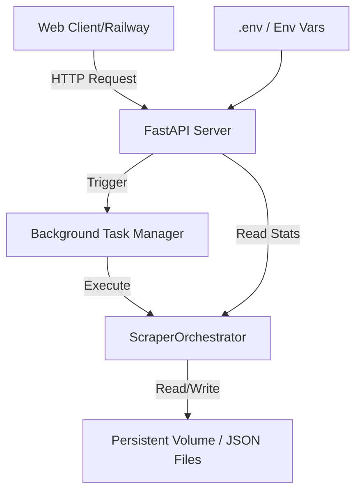

# Requirements orientation

### Overview & Goals
The goal is to transform the Mostaql Scraper from a local CLI tool into a production-ready background service suitable for 24/7 operation on platforms like Railway. This involves moving configuration to environment variables and exposing the scraper's functionality through a FastAPI web server while removing the CLI entry point.

### Scope
- **In Scope**:
    - Configuration migration to Pydantic Settings with `.env` support.
    - Implementation of a FastAPI application with endpoints for triggering scrapes, checking status, and retrieving results.
    - Removing/Deprecating the Typer-based CLI.
    - Background task management for long-running scrapes.
    - Production-ready logging and error handling.
- **Out of Scope**:
    - Developing a new frontend (will continue to serve existing `dashboard.html` or stats via API).
    - Database integration (will continue to use persistent volumes/JSON files for now, as per previous issue discussion).

# Technical Design

### Current Implementation
The project currently uses `typer` for CLI commands and a `ScrapeConfig` dataclass with hardcoded defaults. Scraping is triggered manually via the terminal.

### Key Decisions
1. **Pydantic Settings**: We will use `pydantic-settings` to handle configuration. This allows seamless override of defaults via `.env` files or environment variables, which is standard for cloud deployments.
2. **FastAPI for Orchestration**: FastAPI will replace `main.py` as the entry point. It will manage the `ScraperOrchestrator` and trigger phases as `BackgroundTasks`.
3. **Persistent Volumes**: Since Railway containers are ephemeral, the server will be designed to work with mounted volumes for JSON/CSV persistence.

### Proposed Architecture

### File Structure Changes
- `src/models.py`: Refactor `ScrapeConfig` to use Pydantic.
- `src/main_api.py`: New entry point for the FastAPI application.
- `main.py`: To be removed or converted into a minimal wrapper for the API.
- `.env.example`: New file for environment variable documentation.
- `requirements.txt`: Add `fastapi`, `uvicorn`, `pydantic-settings`.

# Testing strategy

### Validation Approach
Verification will be done by deploying the service locally and via API calls:
- **Config Check**: Verify that changing a value in `.env` (e.g., `MAX_PAGES`) reflects in the app without code changes.
- **Health Check**: `GET /health` returns 200.
- **Functional Check**: `POST /scrape` starts a background task and `GET /stats` shows progress.
- **Artifact Check**: Verify JSON files are created in the expected directory and accessible via `GET /results`.

# Delivery Steps

### ✓ Step 1: Migrate configuration to Pydantic Settings with .env support
Make `ScrapeConfig` production-ready by integrating environment variable support.
- Add `pydantic-settings` to `requirements.txt`.
- Refactor `src/models.py`: convert `ScrapeConfig` to a Pydantic `BaseSettings` class.
- Map existing fields to environment variables (e.g., `BASE_URL`, `MAX_PAGES`, `OUTPUT_JSON`).
- Update `resolve_path` to handle environmental overrides correctly.
- Add a `.env.example` file with all available configuration keys.

### ✓ Step 2: Implement FastAPI backend and API endpoints
Implement the core FastAPI application to expose scraper functionality via HTTP.
- Create `src/main_api.py` (or rename/refactor `main.py`).
- Add endpoints:
  - `GET /health`: Basic health check for Railway.
  - `POST /scrape`: Trigger a full or partial pipeline (with parameters for `deep`, `limit`, etc.).
  - `GET /stats`: Return current scraping progress and metrics.
  - `GET /results`: List and download generated JSON/CSV files.
- Integrate `ScraperOrchestrator` into FastAPI as a singleton or dependency.
- Implement background tasks for long-running scrape operations.

### ✓ Step 3: Finalize production-ready server and remove CLI dependencies
Transition the project from a CLI-first to a Server-first architecture.
- Remove `typer` and CLI-specific logic from the main entry point if requested (or keep it as a secondary option).
- Update `src/utils/reporting.py`: ensure logging and progress reporting work correctly in a non-interactive server environment (redirect `tqdm` to logs).
- Update `README.md` with API usage instructions and deployment steps.
- Create a `Dockerfile` optimized for FastAPI on Railway.