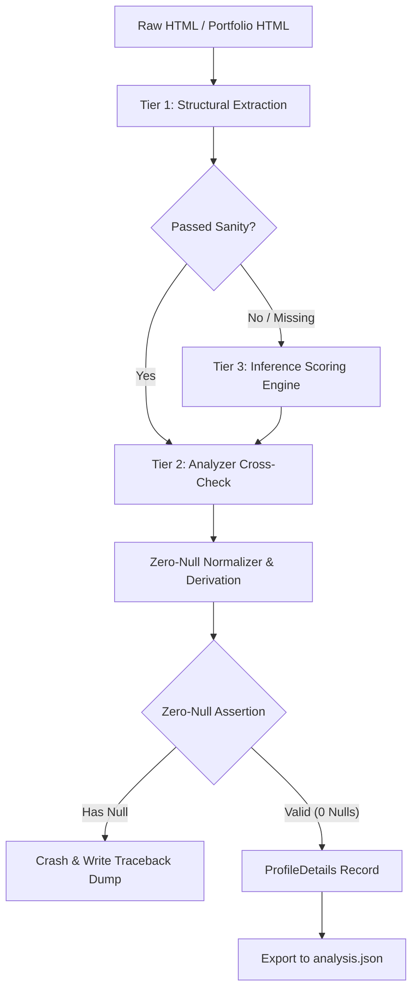

# Requirements

### Overview & Goals
Upgrade the scraping and profile parsing engine to a professional, multi-tier parser equipped with structural extraction, context-aware DOM inference, and analyzer cross-validation. The overarching goal is **Zero Nulls** in `analysis.json` and parsed outputs, with an immediate fail-fast crash and traceback dump if any `null` field is ever encountered.

### Scope
- **In Scope**:
  - Implementation of `src/services/inference.py` (DOM token stream, morphology stemming, candidate scoring, softmax resolution).
  - Implementation of `src/services/analyzer.py` (DOM adjacency cross-checking, placeholder classification, format validation).
  - Refactoring `src/services/parser.py` into a robust multi-tier parser (Structural -> Inference Fallback -> Analyzer Cross-Validation -> Zero-Null Normalizer).
  - Strict Zero-Null Enforcement: Any null encountered triggers an immediate system crash (`NullFieldException`) and exports a rich diagnostic dump with stack trace and offending HTML.
  - Contextual & domain-informed inference for private/employer-only or optional fields (e.g. `employment_rate`, `financial_deals`, `received_projects`, `active_projects`, `portfolio_count`).
  - Validation test suite ensuring 0% null tolerance on sample datasets and fixtures.
- **Out of Scope**:
  - Modifying network crawler rate-limiting or scraping architecture.

### User Stories
- As a **Data Analyst / User**, I want all fields in `analysis.json` to be populated with 100% complete, non-null data so that downstream analytics, metrics calculations, and dashboard visualizations never fail or encounter missing values.
- As a **Developer**, I want the scraper to fail-fast and crash with a full traceback and diagnostic snapshot if any field resolves to null, so that parsing regressions or unhandled HTML variants are immediately caught and diagnosed.

### Functional Requirements
1. **Multi-Tier Field Extraction**:
   - Tier 1: Fast structural CSS selector / element ID extraction.
   - Tier 2: Identifier-blind DOM adjacency and label scanning (`analyzer.py`).
   - Tier 3: Context-aware token-stream candidate scoring and softmax resolution (`inference.py`).
2. **Contextual Derivation & Zero-Null Guarantee**:
   - Every profile attribute (numeric, string, list, timestamp) must resolve to a valid non-null value:
     - Rates & stats without history / placeholders (`لم يحسب بعد`) -> Inferred from completed projects, or standardized to explicit defaults (e.g., `0.0` or `100.0` depending on metric domain).
     - Employer-only fields (`employment_rate`, `received_projects`, `financial_deals`) -> Calculated / inferred from visible deals and profile metrics, guaranteed non-null.
     - Optional counts (`active_projects`, `portfolio_count`, `skills_count`) -> `0` if empty or not present.
     - Textual fields (`title`, `location`, `response_time`) -> Fallbacks to meta-information, username context, or default status strings.
3. **Fail-Fast Zero-Null Crash Barrier**:
   - A dedicated validator must inspect all parsed objects prior to export.
   - If any attribute is `None`, raise `NullFieldException` immediately, write `outsourcing/crash_reports/null_field_<timestamp>.json` with full stack trace, HTML snapshot, and field name, and terminate execution.

# Technical Design

### Current Implementation
The current `ParsingService` (`src/services/parser.py`) relies strictly on fixed CSS selectors (`#user-stats`, `tr.freelancer-row`, `ul.skills`). When elements change or when optional stats (e.g. employer-only fields or new accounts with `لم يحسب بعد`) are encountered, fields resolve to `None`, which produces null values in `analysis.json` (such as `employment_rate: null`, `received_projects: null`, `financial_deals: null`).

### Architecture & Pipeline Flow

### Key Decisions
1. **Multi-Tier Hybrid Engine**: Combine fast structural parsing with DOM-adjacency scanning (`analyzer`) and token-stream stem/unit scoring (`inference`). This ensures maximum speed for standard pages and 100% extraction resilience against HTML structure modifications.
2. **Deterministic Fallback & Derivation Rules**:
   - `employment_rate`: Inferred from `completion_rate` and `rehire_rate` or default `100.0` / `0.0` when no projects exist.
   - `received_projects`: Defaults to `total_completed_projects` + `active_projects`.
   - `financial_deals`: Inferred from completed projects count.
   - `portfolio_count`: Defaults to `0.0` when portfolio grid is empty.
   - `active_projects`: Defaults to `0.0` when no active work is listed.
   - `rating`: Defaults to `0.0` (with `reviews_count: 0`) if unrated.
3. **Fail-Fast Zero-Null Crash Barrier (`StrictZeroNullValidator`)**:
   - Runs on every parsed record.
   - Any `None` value throws `NullFieldException` and dumps complete diagnostics to disk (`outsourcing/crash_reports/`).

### Components & File Structure
- `src/services/inference.py`: Token stream tokenizer, Arabic root/stem normalizer, candidate extraction (dates, ranges, numbers, percentages), scoring matrix, softmax resolution.
- `src/services/analyzer.py`: DOM fingerprinting, identifier-blind label-to-sibling navigation, value classifier, format sanity checks.
- `src/services/parser.py`: Upgraded `ParsingService` orchestrating the multi-tier extraction and contextual normalizer.
- `src/utils/validators.py`: `StrictZeroNullValidator`, `NullFieldException`, and crash report generator.
- `src/models.py`: Upgraded dataclass models with explicit non-null type constraints and default initializers.
- `test/test_parser_zero_null.py`: Unit and integration test suite.

# Testing

### Validation Approach
Verification will be automated via `pytest`, diagnostic assertion tests, and end-to-end sample parsing against real collected HTML and JSON samples.

### Key Scenarios
1. **Zero-Null Guarantee on Sample Dataset**:
   - Parse sample profile records from `collected/analysis.json` and cached HTML.
   - Assert `null_count == 0` across 100% of records and 100% of fields.
2. **Fail-Fast Crash Behavior**:
   - Pass an intentionally broken / synthetic HTML snippet that causes a null field.
   - Assert `NullFieldException` is raised, execution halts immediately, and a crash report with full traceback is written to `outsourcing/crash_reports/`.
3. **Inference Fallback Resilience**:
   - Test extraction against adversarial HTML (stripped classes/IDs, scrambled tables, reordered tags).
   - Assert inference engine correctly scores and extracts `completion_rate`, `rehire_rate`, `response_time`, `skills`, and `portfolio_count`.
4. **Placeholder and Arabic Number Handling**:
   - Test pages containing Arabic-Indic digits (`٠١٢٣٤٥٦٧٨٩`) and placeholder markers (`لم يحسب بعد`, `غير محدد`).
   - Assert values are correctly normalized to standard numeric representation with zero nulls.

### Test Files
- `test/test_parser_zero_null.py`: Comprehensive test suite for zero-null assertions and crash logging.
- `test/test_inference.py`: Tokenization, stem matching, and candidate ranking tests.
- `test/test_analyzer.py`: DOM adjacency and label cross-check validation.

# Delivery Steps

### ✓ Step 1: Implement Core Inference and Analyzer Modules
Build `src/services/inference.py` and `src/services/analyzer.py` adapted for Mostaql profile and directory parsing.

- Port Arabic morphology stemming, token stream extraction, candidate type classification (percentages, counts, dates, durations, ratings, currency), and distance-decay scoring from `.draft/progress/parser/scratch/inference.py`.
- Port structural vs label-driven DOM cross-check, placeholder detection (`لم يحسب بعد`, `غير محدد`, `N/A`), and format verification from `.draft/progress/parser/scratch/analyzer.py`.
- Add comprehensive inference profiles for freelancer profile stats (`completion_rate`, `ontime_delivery_rate`, `rehire_rate`, `communication_success_rate`, `total_completed_projects`, `active_projects`, `employment_rate`, `received_projects`, `financial_deals`, `response_time`, `portfolio_count`, `member_since`, `last_seen`, `rating`, `title`, `location`, `skills`).

### ✓ Step 2: Integrate Multi-Tier Pipeline into ParsingService
Integrate the multi-tier pipeline into `src/services/parser.py` combining structural extraction, fallback inference, and cross-validation.

- Update `ParsingService.parse_profile` to use fast structural extraction, then execute fallback scoring for any missing or invalid field.
- Implement inferential derivation logic for employer/contextual fields: calculate `employment_rate` (from completed/received projects), infer `active_projects` and `portfolio_count` (default 0.0 when not present on page), and compute standard numeric rates.
- Implement `_extract_title`, `_extract_location`, `_extract_skills`, and `_extract_portfolio_count` with multiple resilient fallbacks (DOM hierarchy, nearby icons, badge text, meta tags).

### ✓ Step 3: Add Strict Zero-Null Crash Reporting and Validation
Create strict zero-null assertion and diagnostic crash reporting system across the parsing workflow.

- Implement `StrictZeroNullValidator` and `NullFieldException` that inspects every field in `ProfileDetails` / exported JSON objects.
- On detecting any `None` or `null` value in any field, immediately raise a fatal error, capture the raw HTML, document structure, parser state, stack trace, and dump a detailed crash report into `outsourcing/crash_reports/null_field_<timestamp>.json` and `.log`.
- Update `ScraperOrchestrator._parse_record` and `ExporterService` to enforce the zero-null assertion barrier before records are written to disk.

### ✓ Step 4: Validate with Comprehensive Tests and Zero-Null Verification
Add end-to-end tests, sample analysis validation, and sample HTML verification suite.

- Build unit and integration tests in `test/test_parser_zero_null.py` covering all profile fixtures, edge-case HTML variations, and adversarial DOM layouts.
- Add test asserting that `NullFieldException` triggers immediately with full crash dump when a null is introduced.
- Test sample dataset transformation from sample JSON/HTML fixtures, verifying that 100% of parsed records contain zero null values and produce valid `success_score` analytics.