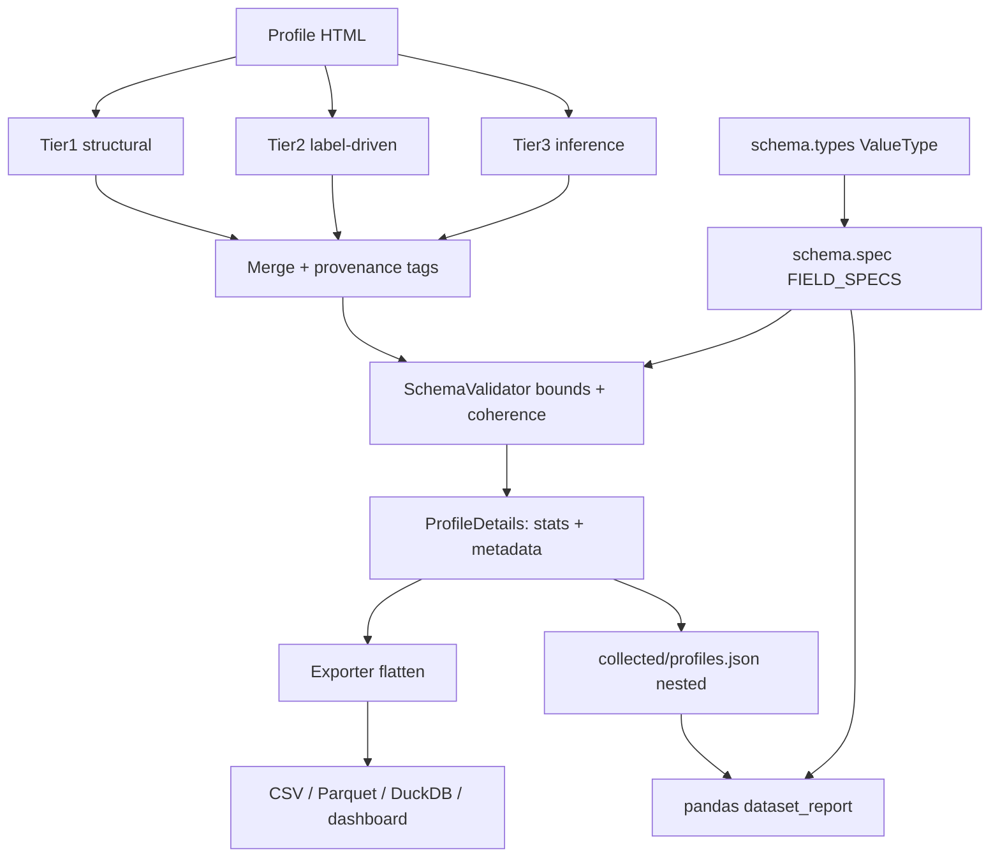

# Requirements

### Overview & Goals
The parser currently produces values nobody can trust: `8266` completed projects for a brand-new account, `100.0` rates invented for uncalculated profiles, duplicated `stats`/top-level keys, and no way to tell whether a number came from the DOM or from a guess.

Goal: turn the profile record into a **strong, self-describing, schema-validated model**, derived from evidence in real HTML rather than assumptions:

1. Survey 5 real profile HTML pages to learn the actual value space of every field.
2. Encode that knowledge as a declarative field spec + Pydantic model (single source of truth).
3. Build a reusable **value-type library** (`Percentage`, `Count`, `Rating`, `Money`, `Duration`, `ArabicDate`, `Text`, `Enum`, `ListOf`, `OneOf`) so every key declares *what kind of value it holds*, how it is parsed from raw Arabic HTML text, its min/max and its formatting — instead of ad-hoc `clean_numeric_value` calls scattered across the parser.
4. Attach a per-field `metadata` block: how the value was obtained, how confident we are, whether it is an outlier.
5. Never silently fabricate: raw parsed value is kept as-is, violations are warned about and flagged — not overwritten.
6. Never let an exception escape: every parse/coerce step is total — it always returns a value plus an issue list.

### Scope

**In scope**
- Fixture corpus: 5+ real profile HTML files saved under `test/fixtures/profiles/`.
- Field survey tooling that reports observed labels, raw strings and value ranges per field.
- A `src/schema/types.py` value-type library with composable types and union support (`OneOf(Count(), Text())`).
- Exhaustive error handling: every raw→typed conversion returns `ParseOutcome(value, raw, issues, confidence)` and never raises.
- `ProfileDetails` converted to a Pydantic model in `src/models.py` with a nested `stats` object and slim top-level.
- Per-field provenance/quality `metadata` sub-object in every record.
- Range/plausibility rules (no negatives, rates 0–100, projects soft-cap ~500, dates within Mostaql's lifetime, coherence rules like `received >= completed`).
- Dataset-level pandas validation report over `collected/profiles.json`.
- Exporter flattening so CSV/Parquet/DuckDB and the dashboard keep their current flat columns.
- Tests driven by the fixture corpus.

**Out of scope**
- Changing the crawling/network layer or the dashboard UI.
- Re-scraping the whole dataset (a re-parse script is provided, running it is the user's call).

### User Stories
- As a data consumer, I want to see *how* each field was obtained (DOM label, structural table, inference, default) so I can decide whether to trust it.
- As a data consumer, I never want to see an implausible value (8266 projects, 100% rate on an empty profile) presented as a fact — it must be flagged as an outlier.
- As a maintainer, I want one place that defines every field's type, domain and bounds, so parser, exporter, validator and dashboard cannot drift apart.
- As a maintainer, I want the JSON record free of duplicated keys.

### Functional Requirements
- **FR1 — Evidence-based spec.** Every numeric/enum bound in the spec is justified by a value observed in the fixture survey (or an explicit business rule, e.g. rates ≤ 100).
- **FR2 — Per-field metadata.** Each record has `metadata.fields[<field>] = {source, confidence, raw, outlier, issues}` where `source ∈ {dom_structural, dom_label, derived, inferred, default}`.
- **FR3 — Keep-raw policy.** A value violating a bound is **kept**, a warning is logged, `outlier=true` and an issue code are recorded, and `metadata.quality` is downgraded (`ok` → `suspect` → `bad`).
- **FR4 — No duplication.** Numeric/temporal metrics live under `stats`; top level keeps identity/profile fields only (`name`, `profile_url`, `title`, `location`, `bio`, `skills`, `verifications`, `badges`, `rank`, `scraped_at`, `metadata`).
- **FR5 — Flat export preserved.** CSV/Parquet/DuckDB exports still contain today's flat column names.
- **FR6 — Dataset report.** A pandas-based checker prints per-field null/default/outlier counts, min/max/percentiles and top offenders.

### Non-Functional Requirements
- Zero-null guarantee from `StrictZeroNullValidator` is preserved.
- Validation must not measurably slow parsing (pure-python bound checks per record).
- Arabic text handling (RTL, placeholders like `لم يحسب بعد`) unchanged.

# Technical Design

### Current Implementation
- `src/models.py` — `ProfileDetails` is a frozen dataclass, ~35 flat fields plus a `stats: Dict[str, Any]` that **duplicates** ~20 of them.
- `src/services/parser.py` (`ParsingService.parse_profile`, `_extract_stats`) — 3-tier extraction: `structural_profile_extract` (Tier 1) → `label_driven_extract` (Tier 2) → `infer_fields` (Tier 3). Tier 3 is what produced `8266` (grabbed from `ESP8266` in the bio). It was recently restricted to genuinely-missing fields, but there is still no bound checking anywhere.
- `src/services/analyzer.py` — `clean_numeric_value`, `clean_percentage_str`, `is_placeholder`, `KNOWN_PROFILE_LABELS`, plus record normalization.
- `src/services/inference.py` — token-candidate scanner, already excludes `#about_content`.
- `src/utils/validators.py` — `StrictZeroNullValidator`: null-only, fail-fast, crash dumps to `outsourcing/crash_reports/`.
- `src/services/exporter.py`, `src/dashboard.py`, `dashboard/db/schema.py` — all consume **flat** column names (`total_completed_projects`, `completion_rate`, …).
- No real HTML fixtures exist; `htmls/` only holds rendered dashboards. Tests use hand-written snippets.
- `pandas`, `numpy`, `duckdb`, `pyarrow`, `pydantic-settings` (so `pydantic` v2) are already dependencies.

### Key Decisions
1. **Pydantic v2 model in `src/models.py`** (user's choice) — `ProfileDetails` becomes `BaseModel` with `model_config = ConfigDict(frozen=True, validate_assignment=True)`. `dataclasses.asdict()` call sites are migrated to `model_dump()`; a `to_dict()` helper keeps churn small.
2. **Declarative `FIELD_SPECS` next to the model** — a single table of `FieldSpec(name, group, dtype, default, min, max, soft_max, allowed, unit, derived_from)`. The Pydantic validators, the pandas dtype map, and the dataset report are all generated from it, so nothing can drift.
3. **Keep-raw + flag** (user's choice) — bound violations never mutate the value. `ProfileMetadata` carries the verdict.
4. **Nested `stats`, slim top level** (user's choice) — `ProfileDetails.stats: ProfileStats`. Exporter flattens (`stats.*` → flat columns) so the dashboard/DuckDB layer is untouched.
5. **Evidence first** — spec bounds are written *after* the fixture survey, not guessed.
6. **Value types are the parsing unit** — each `FieldSpec` owns a `ValueType` instance encapsulating `parse(raw) -> ParseOutcome`, `validate(value)`, `format(value)`, `pandas_dtype`, `default`, `min/max/soft_max`. The parser stops knowing about Arabic digits, `%`, `(0)` or `لم يحسب بعد` — the types do.
7. **Lean on pandas, don't reinvent it** — nullable `Int64`/`Float64`/`boolean`/`string` dtypes, `CategoricalDtype`, `pd.to_numeric(errors="coerce")`, `pd.to_datetime(errors="coerce")`, `Series.between`/`clip`, `describe()`/`quantile()` back the dtype contract and the dataset-level checks; each record-level type maps 1:1 onto a pandas dtype so record and frame validation can never disagree.
8. **Total functions, no exceptions** — malformed input yields the type's default plus an issue code; an unexpected exception inside a type is caught, recorded as `internal_error`, and downgrades quality to `bad`.

### Proposed Changes

**1. Fixture corpus + survey (`test/fixtures/profiles/*.html`, `outsourcing/field_survey/`)**
- Download 5 deliberately diverse profiles: an empty/new account (`Smartify`), a heavy top freelancer (hundreds of projects), a mid-range one, a profile with partly-calculated stats, and a non-Arabic/edge-name one.
- `test/tools/survey_fields.py` walks each fixture, and for every field prints: matched label text, raw cell string, which tier produced it, parsed value. Output is aggregated into `outsourcing/field_survey/field_domains.md` — the evidence table for the spec.

**1b. Value-type library (`src/schema/types.py`)**
- Abstract `ValueType` base with `parse`, `validate`, `format`, `pandas_dtype`, `default`.
- Concrete types (names illustrative; the final set is decided by the survey): `Text`, `Enum`, `Count`, `Percentage`, `Rating`, `Money`, `Duration`, `ArabicDate`, `RelativeTime`, `ListOf`, `OneOf` (union).
- Shared normalization used by all numeric types: Arabic-Indic digit folding (`٠-٩`, `۰-۹`), thousands separators (`,`, `٬`), `%`, `+`, parentheses `(0)`, RTL/LTR marks, NBSP, and placeholder detection (`لم يحسب بعد`, `غير محدد`, `-`, `—`).
- Every type declares its pandas dtype (`Int64`, `Float64`, `string`, `CategoricalDtype([...])`, `datetime64[ns]`) and internally reuses `pd.to_numeric` / `pd.to_datetime` with `errors="coerce"`.
- `OneOf` tries member types in order and reports the winning branch in `ParseOutcome.matched_type`.

**2. Field spec (`src/schema/spec.py`)**
- `FieldSpec` dataclass + `FIELD_SPECS: dict[str, FieldSpec]`, each entry binding a key to a `ValueType`.
- Rules (to be finalised from the survey):
  - rates (`completion_rate`, `ontime_delivery_rate`, `rehire_rate`, `communication_success_rate`, `employment_rate`): `0 ≤ x ≤ 100`.
  - `total_completed_projects`, `active_projects`, `received_projects`, `financial_deals`, `portfolio_count`, `skills_count`, `reviews_count`: integers `≥ 0`, `soft_max = 500` → outlier flag above it, hard implausible above `5000`.
  - `rating`: `0 ≤ x ≤ 5`.
  - `avg_response_time_minutes`: `0 < x ≤ 43200` (30 days).
  - `registration_date`: between `2013-01-01` and now.
  - Coherence: `received_projects ≥ total_completed_projects`; `total_completed_projects == 0 ⇒ all rates == 0`; `reviews_count == 0 ⇒ rating == 0`.

**3. Models (`src/models.py`)**
- `FieldMeta`, `ProfileMetadata`, `ProfileStats`, `ProfileDetails` as Pydantic models; a model-level validator runs the `FIELD_SPECS` checks and records issues instead of raising.

**4. Parser (`src/services/parser.py`)**
- `_extract_stats` returns `(values, provenance)` — each tier tags which field it produced (`dom_structural` / `dom_label` / `inferred`), derivations tag `derived`, fallbacks tag `default`.
- `parse_profile` assembles `ProfileStats` + `ProfileMetadata` and logs `log.warning` for every outlier with the profile URL.

**5. Validation (`src/utils/validators.py`)**
- Add `SchemaValidator.validate_profile(profile)` → `list[Issue]`, run alongside the existing zero-null barrier.
- Add `dataset_report(df) -> str` (pandas): per-column dtype, null/default share, min/max/p50/p95/p99, outlier count, worst offenders.

**6. Export & consumers (`src/services/exporter.py`, `src/services/analyzer.py`, `src/services/orchestrator.py`, `src/dashboard.py`)**
- Flatten `stats.*` and `metadata.quality`/`metadata.outlier_fields` into the tabular exports; keep existing column names.
- Optional `outsourcing/quarantine_profiles.json` listing records whose `metadata.quality != "ok"`.

**7. Re-parse utility (`test/tools/reparse_collected.py`)**
- Re-parses cached HTML in `collected/cache/`, writes a fresh `collected/profiles.json` in the new shape and prints the dataset report.

### Data Models / Contracts
```python

# --- value-type layer -------------------------------------------------

@dataclass(frozen=True)
class ParseOutcome:
    value: Any              # always populated (type default on failure)
    raw: str                # original text
    issues: list[str]       # ["placeholder", "unparsable", "below_min", "above_soft_max", ...]
    confidence: float       # 0.0 .. 1.0
    matched_type: str = ""  # which branch won, for OneOf unions

class ValueType(ABC):
    default: Any
    pandas_dtype: str | CategoricalDtype
    def parse(self, raw: str | None) -> ParseOutcome: ...   # never raises
    def validate(self, value: Any) -> list[str]: ...
    def format(self, value: Any) -> str: ...

Percentage(min=0, max=100, decimals=1, unit="%")
Count(min=0, soft_max=500, hard_max=5000, dtype="Int64")
Rating(min=0, max=5, decimals=2)
Money(currency="USD", min=0, soft_max=1_000_000)
Duration(unit="minutes", min=0, max=43_200)       # "خلال يوم" -> 1440
ArabicDate(min="2013-01-01", max="now")           # "27 ديسمبر 2023" -> datetime
Enum(allowed=[...], dtype=CategoricalDtype([...]))
ListOf(Text(max_len=80), max_items=50)
OneOf(Count(), Text())                            # union-valued keys

@dataclass(frozen=True)
class FieldSpec:
    name: str
    group: Literal["identity", "stats", "content", "meta"]
    type: ValueType
    labels: list[str]          # Arabic labels observed in the survey
    derived_from: tuple[str, ...] = ()
    required: bool = False

# --- record layer -----------------------------------------------------

Source = Literal["dom_structural", "dom_label", "derived", "inferred", "default"]

class FieldMeta(BaseModel):
    source: Source = "default"
    confidence: float = 0.0        # 0.0 .. 1.0
    raw: str = ""                  # original HTML text
    outlier: bool = False
    issues: list[str] = []         # e.g. ["above_soft_max", "incoherent_with_completed"]
    type: str = ""                 # value-type that produced it, e.g. "Percentage"
    formatted: str = ""            # display form from ValueType.format()

class ProfileMetadata(BaseModel):
    quality: Literal["ok", "suspect", "bad"] = "ok"
    schema_version: str = "2.0"
    parse_signals: list[str] = []
    outlier_fields: list[str] = []
    fields: dict[str, FieldMeta] = {}

class ProfileStats(BaseModel):       # all numeric/temporal metrics live here, once
    rating: float = 0.0
    reviews_count: int = 0
    completion_rate: float = 0.0
    ...
    registration_date: str = ""

class ProfileDetails(BaseModel):     # slim top level
    name: str
    profile_url: str
    title: str = "مستقل"
    location: str = "غير محدد"
    bio: str = ""
    skills: list[str] = []
    verifications: list[str] = []
    badges: list[str] = []
    stats: ProfileStats = ProfileStats()
    metadata: ProfileMetadata = ProfileMetadata()
    rank: int = 1
    scraped_at: str
```

### File Structure
```
test/fixtures/profiles/*.html          (new) 5 real profile snapshots
test/tools/survey_fields.py            (new) field/value survey
test/tools/reparse_collected.py        (new) re-parse cached HTML
outsourcing/field_survey/field_domains.md (new) evidence table
src/schema/__init__.py                 (new) public re-exports
src/schema/types.py                    (new) ValueType library + ParseOutcome
src/schema/spec.py                     (new) FieldSpec + FIELD_SPECS
src/schema/frame.py                    (new) pandas dtype map + frame-level checks
src/models.py                          (mod) Pydantic ProfileDetails/Stats/Metadata
src/services/parser.py                 (mod) provenance-tagged extraction
src/utils/validators.py                (mod) SchemaValidator + dataset_report
src/services/exporter.py               (mod) flatten stats for CSV/Parquet
src/services/analyzer.py               (mod) normalization aligned to spec
src/services/orchestrator.py           (mod) model_dump instead of asdict
test/test_value_types.py               (new) per-type parse/validate/format matrix
test/test_schema_spec.py               (new) bound/coherence rules
test/test_fixture_profiles.py          (new) golden expectations per fixture
```

### Architecture Diagram


### Risks
- **Breaking consumers of the flat shape** — mitigated by exporter flattening and a `to_flat_dict()` helper; dashboard/DuckDB columns stay identical.
- **Frozen-dataclass → Pydantic migration** touches ~10 call sites (`asdict`, `dataclasses.fields`, tests) — handled by a compatibility `to_dict()` and a full test run.
- **Fixtures may not cover every layout variant** — the survey script is kept in-repo so new fixtures can be added and bounds revised cheaply.
- **Soft cap of 500 projects** may legitimately be exceeded by a top account — that's why it flags rather than clamps.
- **Over-engineering the type library** — kept in check by adding a type only when a real field needs it; the survey decides the final list.
- **pandas nullable dtypes (`Int64`/`Float64`) can surprise downstream code** (DuckDB, Streamlit) — the exporter casts back to plain numpy dtypes after validation, covered by an export test.

# Testing

### Validation Approach
All bounds come from the fixture survey, and every fixture becomes a golden test. The existing suite (74 tests) must stay green.

### Key Scenarios
- Each of the 5 fixtures parses into a `ProfileDetails` whose values match a checked-in golden expectation.
- Empty account (`Smartify`): all rates and project counts `0.0`, `metadata.fields[...].source == "default"`, `quality == "ok"`, bio/badges/verifications populated, and **no** `8266` anywhere.
- Active freelancer fixture: rates come from `dom_structural`/`dom_label` with `confidence >= 0.8`, project counts within bounds.
- JSON output contains each metric exactly once (no top-level/`stats` duplication).
- Flat CSV export still has the legacy column names consumed by `dashboard/db/schema.py`.

### Edge Cases
- Value-type matrix: Arabic-Indic digits (`٨٢`), `1,234`, `‎85%‎`, `(0)`, `+500`, empty string, `None`, HTML entities and a 10k-char bio fed to every type — each returns the default plus a precise issue code and never raises.
- `OneOf(Count(), Text())` on both a numeric and a textual raw value; `matched_type` recorded correctly.
- Placeholder `لم يحسب بعد` in every stats row → defaults, never inference.
- A crafted HTML with a bio containing `ESP8266`, `100%`, `2019` → those tokens must not leak into stats.
- Synthetic out-of-range values (rate `150`, projects `9999`, negative count) → value kept, `outlier=true`, issue code recorded, `quality` downgraded, warning logged.
- Coherence breach (`received < completed`) → flagged on both fields, values untouched.
- Zero-null: `StrictZeroNullValidator` still passes for every fixture.

### Test Changes
- New: `test/test_schema_spec.py`, `test/test_fixture_profiles.py`.
- Updated: `test/test_parser_zero_null.py`, `test/test_parser.py`, `test/test_parser3.py`, `test/test_analyzer.py` for the nested `stats` / Pydantic access shape.
- Run with `python -m pytest test/` (note: bare `pytest` fails to import `src`).

# Delivery Steps

###   Step 1: Build the fixture corpus and survey the real value space
Five real profile HTML snapshots exist in the repo and a written evidence table describes the observed value space of every field.

- Download 5 diverse profiles into `test/fixtures/profiles/`: an empty/new account (`mostaql.com/u/Smartify`), a high-volume top freelancer, a mid-range freelancer, a partially-calculated profile, and a latin-name/edge-layout profile.
- Add `test/tools/survey_fields.py` that, per fixture and per field, dumps the matched label, the raw cell text, the extraction tier that produced it, and the parsed value.
- Aggregate results into `outsourcing/field_survey/field_domains.md`: observed labels, distinct raw strings, min/max numeric values, and placeholder variants.
- Record concrete findings that will drive bounds (rate range, realistic project counts, response-time phrasings, date formats).

###   Step 2: Build the value-type library
`src/schema/types.py` provides composable, total value types that turn raw Arabic HTML text into validated, formatted values.

- Add `ParseOutcome` and the abstract `ValueType` (`parse`, `validate`, `format`, `pandas_dtype`, `default`), guarding every call so an internal exception becomes an `internal_error` issue instead of propagating.
- Implement shared normalization: Arabic-Indic digit folding, thousands separators, `%`/`+`/parentheses stripping, RTL marks, NBSP, and placeholder detection (`لم يحسب بعد`, `غير محدد`, `-`).
- Implement the concrete types: `Text`, `Enum`, `Count`, `Percentage`, `Rating`, `Money`, `Duration`, `ArabicDate`, `RelativeTime`, `ListOf`, and the `OneOf` union recording `matched_type`.
- Give each type an explicit pandas dtype (`Int64`, `Float64`, `string`, `CategoricalDtype`, `datetime64[ns]`) and reuse `pd.to_numeric` / `pd.to_datetime` with `errors="coerce"` internally.
- Add `test/test_value_types.py` covering the malformed-input matrix for every type.

###   Step 3: Declare the field spec module
`src/schema/spec.py` is the single source of truth: every key bound to a value type, with labels, bounds and coherence rules.

- Add a `FieldSpec` dataclass (`name`, `group`, `type`, `labels`, `derived_from`, `required`) and populate `FIELD_SPECS` for all profile fields from the survey evidence.
- Encode bounds through the types: rates 0–100, rating 0–5, counts >= 0 with `soft_max=500` / `hard_max=5000`, response minutes 0–43200, registration date 2013-01-01..now.
- Encode coherence rules: `received_projects >= total_completed_projects`, zero completed projects implies zero rates, zero reviews implies zero rating.
- Add `src/schema/frame.py` exposing `pandas_dtypes()`, `apply_dtypes(df)` and vectorised `between`/`clip`-based frame checks reused by the exporter and reports.

###   Step 4: Convert the profile models to Pydantic with nested stats and metadata
`ProfileDetails` is a Pydantic v2 model with a slim top level, a nested `ProfileStats`, and a `ProfileMetadata` block — no duplicated keys.

- In `src/models.py`, add `FieldMeta`, `ProfileMetadata`, `ProfileStats` and rewrite `ProfileDetails` as a frozen `BaseModel`.
- Move all numeric/temporal metrics into `ProfileStats`; keep identity, text and list fields at top level.
- Add a model validator that runs the `FIELD_SPECS` bound and coherence checks, keeps the raw value, and records `outlier`/`issues` in `metadata`.
- Add `to_dict()` / `to_flat_dict()` helpers and migrate `asdict()` call sites in `src/services/orchestrator.py`, `src/services/exporter.py`, `src/utils/validators.py` and `test/diagnose_nulls.py`.

###   Step 5: Emit provenance and confidence from the parser
Every parsed field carries where it came from and how confident the parser is.

- Change `_extract_stats` in `src/services/parser.py` to return `(values, provenance)`, tagging Tier 1 as `dom_structural`, Tier 2 as `dom_label`, Tier 3 as `inferred`.
- Tag derived fields (`employment_rate`, `received_projects`, `financial_deals`) as `derived` and fallbacks as `default`, with matching confidence values.
- Route every raw string through `FIELD_SPECS[field].type.parse(raw)` instead of ad-hoc `clean_numeric_value` / `clean_percentage_str` calls, storing the resulting `issues`, `confidence`, `formatted` and type name in `FieldMeta`.
- Store the original raw HTML text per field in `FieldMeta.raw`.
- Assemble `ProfileStats` + `ProfileMetadata` in `parse_profile`, set `metadata.quality` from the collected issues, and `log.warning` each outlier together with the profile URL.
- Keep the existing Tier-3 restriction so placeholders (`لم يحسب بعد`) never trigger inference.

###   Step 6: Add schema validation and the pandas dataset report
A schema validator runs next to the zero-null barrier and a pandas report summarises dataset health.

- Extend `src/utils/validators.py` with `SchemaValidator.validate_profile(profile) -> list[Issue]` driven by `FIELD_SPECS`, preserving the existing `StrictZeroNullValidator` behaviour.
- Add `dataset_report(df)` producing per-column dtype, null/default share, min/max/p50/p95/p99, outlier counts and worst offenders.
- Add frame-level validation in `src/schema/frame.py` using vectorised pandas ops (`between`, `notna`, `describe`, `quantile`) so the whole dataset is checked in one pass.
- Write records with `metadata.quality != "ok"` to `outsourcing/quarantine_profiles.json` for review.
- Add `test/tools/reparse_collected.py` to re-parse `collected/cache/` into the new record shape and print the report.

###   Step 7: Keep exports and the dashboard on flat columns
CSV, Parquet and DuckDB outputs keep their current flat column names despite the nested JSON shape.

- Update `src/services/exporter.py` to flatten `stats.*` into top-level columns and append `quality` / `outlier_fields`.
- Apply `FIELD_SPECS`-derived dtypes when building the DataFrame so numeric columns are never object-typed.
- Align record normalization in `src/services/analyzer.py` with the spec defaults and coherence rules.
- Verify `src/dashboard.py` and `dashboard/db/schema.py` resolve every column they expect against the new export.

###   Step 8: Lock the behaviour with fixture-driven tests
The fixture corpus and the schema rules are covered by tests and the whole suite passes.

- Add `test/test_fixture_profiles.py` with golden expectations per fixture, asserting values, `metadata.fields[...].source` and `quality`.
- Add `test/test_schema_spec.py` covering out-of-range values (rate 150, 9999 projects, negatives), coherence breaches, and the keep-raw-plus-flag policy.
- Add a regression test asserting `8266`-style bio tokens never reach any stats field.
- Update `test/test_parser.py`, `test/test_parser3.py`, `test/test_parser_zero_null.py` and `test/test_analyzer.py` for the nested access shape.
- Run `python -m pytest test/` and confirm the full suite is green.